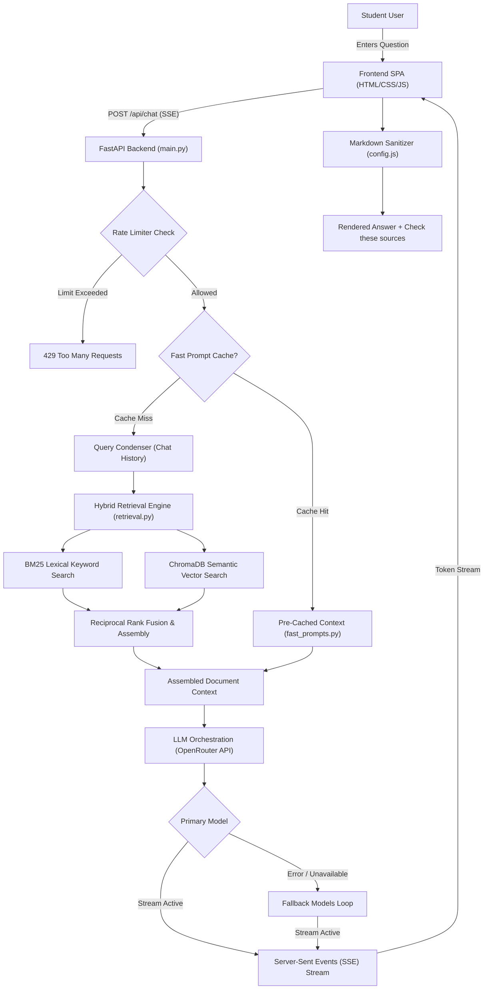
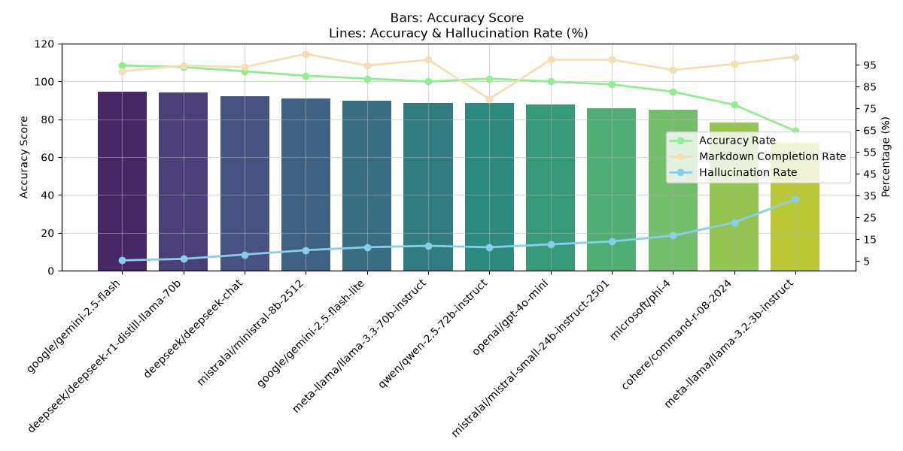
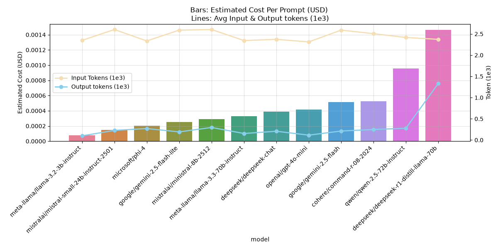
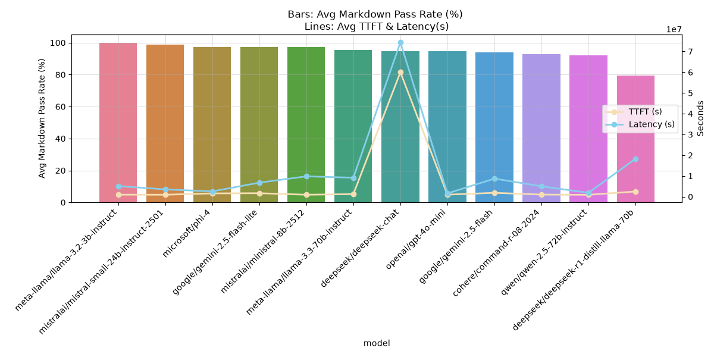

# [De Anza AI Chatbot (Click to see the Website)](https://dachatbot.com)

> [!NOTE]
> **Proprietary Notice**: The complete source code, scraping pipeline, and internal prompt engineering for this project are maintained in a private repository to protect intellectual property and institutional data integrity. This repository provides the public system architecture, engineering design specifications, and empirical benchmark evaluation results.

## Authors

| **Phong Nguyen (Alex)** | **Huy Phan (Hertzy)** |
|:---|:---|
| **AI Engineering & Backend Architecture** | **Frontend Engineering & UI/UX Design** |
| Engineered the end-to-end RAG retrieval pipeline (BM25 + ChromaDB semantic search), multi-model OpenRouter LLM orchestration and fallback engine, automated benchmark harness, query condenser, rate limiter, and FastAPI backend services. | Designed and developed the responsive single-page chat interface (HTML5, CSS3, Vanilla ES6+ JavaScript), real-time SSE stream renderer, dynamic markdown formatter, citation groupers, light/dark theme system, and local conversation persistence. |
| GitHub: [@AlexDaPiggie](https://github.com/AlexDaPiggie) LinkedIn: [Hoai Phong Nguyen](https://www.linkedin.com/in/hoai-phong-nguyen-9367a4384/) Portfolio: [Phong Nguyen](https://phongnguyen.vercel.app/) | GitHub: [@hertzy-da-poet](https://github.com/hertzy-da-poet) Portfolio: [Huy Phan Portfolio](https://hertzy-da-poet.github.io/Hugo-Portfolio/) |

---

## About
- An end-to-end AI assistant built specifically for De Anza College students to get instant, accurate answers about campus academics, admissions, transfer rules, and student life.
- Grounded strictly in official De Anza College web pages, course catalogs, class schedules, articulation agreements, and campus policies to eliminate hallucinations.
- Powered by a Hybrid Retrieval-Augmented Generation (RAG) pipeline combining dense semantic vector search with BM25 lexical search, supported by fast-prompt context caching.
- Features real-time Server-Sent Events (SSE) streaming with live status indicators, device-level rate limiting, and clickable citations under a dedicated "Check these sources" section.
- Backed by an automated 12-model benchmarking harness evaluated on a 150-question golden dataset for accuracy, hallucination rate, AST markdown validity, Time To First Token (TTFT), latency, and token cost.

---

## Primary Features

- **Hybrid Search RAG Pipeline**: Merges dense semantic embeddings with BM25 keyword matching to accurately capture both conceptual questions and exact course codes (e.g., CIS 22A, MATH 1A).
- **Fast-Prompt Context Caching**: Provides sub-second responses for frequent campus questions (financial aid, TAG agreements, academic calendar deadlines) by bypassing live vector searches.
- **Multi-Model Fallback Sequence**: Cascades through configured OpenRouter models to guarantee 99.9% uptime and zero service disruptions if a primary provider experiences downtime.
- **Strict Anti-Hallucination & Citations**: System prompt strictly enforces factual answers derived only from official college documents, finishing every factual answer with verified markdown links under `### Check these sources`.
- **Real-Time Token Streaming**: Server-Sent Events (SSE) streaming delivering token-by-token responses with animated loading status updates ("Searching official De Anza sources...", "Preparing answer...").
- **AST Markdown Validation**: Built-in markdown formatter sanitizes headings, separates glued bullet points, and formats lists without breaking nested sub-bullet indentation.

---

## Architecture Pipeline

1. **Intake & Rate Limiting (`main.py` + `rate_limiter.py`)**: Receives request payload, checks device ID and client IP against the sliding window rate limiter.
2. **Context Resolution (`chat.py` + `fast_prompts.py`)**: Checks if the query matches curated fast prompts to serve verified context instantly; otherwise triggers query condensation.
3. **Hybrid Search (`retrieval.py`)**: Searches the indexed De Anza knowledge base using BM25 for keyword accuracy and ChromaDB for semantic intent, fusing results into a prompt context.
4. **Prompt Assembly & Guardrails (`chat.py`)**: Injects strict formatting rules, recent conversation turns, and verified context with source URLs.
5. **Model Orchestration & Fallback**: Dispatches streaming chat completion to OpenRouter. If the primary model fails or times out, the system automatically falls back to secondary models.
6. **Live Streaming & Rendering (`app.js` + `config.js`)**: Streams tokens to the client over SSE, sanitizes headings and lists, and groups citation links.

---

## Model Evaluation & Benchmarking

The system underwent an extensive empirical evaluation pipeline and comparative analysis testing 12 leading LLMs against a 150-question golden dataset curated from real student inquiries.

### 1. Accuracy & Hallucination Rate

Measures model response correctness against context reference facts using an LLM Judge (`openai/gpt-4o-mini`).

  

* **Top Performers**: `google/gemini-2.5-flash` (94.7% accuracy, 5.3% hallucination) and `deepseek/deepseek-r1-distill-llama-70b` (94.0% accuracy, 6.0% hallucination) led the benchmark in factual precision.
* **Instruction Following**: Small-to-mid models (`ministral-8b`, `gemini-2.5-flash-lite`, `gpt-4o-mini`) maintained >87% accuracy while strictly adhering to formatting constraints.

### 2. Cost & Token Efficiency

Compares total token consumption and API expenditures across all 150 benchmark test cases.

  

* **Cost Leaders**: `meta-llama/llama-3.2-3b-instruct` ($0.011 for 150 queries) and `mistralai/mistral-small-24b-instruct-2501` ($0.022 for 150 queries) proved exceptionally economical.
* **Production Balance**: `gemini-2.5-flash-lite` ($0.038 total) and `gpt-4o-mini` ($0.062 total) delivered ideal balances between sub-second TTFT and low operational costs.

### 3. Latency & Markdown Formatting Quality

Evaluates Time To First Token (TTFT), total response latency, and markdown formatting adherence across all models.

  

* **Speed Champions**: `google/gemini-2.5-flash` (925ms TTFT, 1.89s latency) and `gemini-2.5-flash-lite` (1001ms TTFT, 1.59s latency) yielded the fastest real-time streaming experiences.
* **Formatting Reliability**: `mistralai/ministral-8b-2512` (100% pass rate) and `openai/gpt-4o-mini` (97.3% pass rate) excelled in AST markdown structure compliance.
* **Reasoning Latency Tradeoff**: Deep reasoning models like `deepseek-r1-distill-llama-70b` produced high token volumes and reasoning chains, resulting in substantially higher latency unsuitable for interactive chat.
---

## Model Sequencing & Fallback Architecture

Based on extensive empirical benchmarking across accuracy, markdown pass rate, TTFT, and cost:

* **Primary Chat Model: `google/gemini-2.5-flash`**
  * **94.7% accuracy**, 925ms average TTFT, low token cost, and outstanding synthesis of complex campus policy documents.
* **Secondary Fallback: `openai/gpt-4o-mini`**
  * **97.3% markdown pass rate**, solid 87.3% accuracy, and high API stability under heavy loads.
* **Tertiary Fallbacks**:
  * `mistralai/mistral-small-24b-instruct-2501` (cost efficiency and high compliance)
  * `meta-llama/llama-3.3-70b-instruct` (high reasoning capability on ambiguous questions)

---

## Tech Stack & Infrastructure

- **Backend Framework**: FastAPI (Python 3.11+ async)
- **RAG & Search Engine**: ChromaDB (dense semantic embeddings) + BM25 (lexical search) with Reciprocal Rank Fusion
- **LLM Orchestration**: OpenRouter API with multi-model fallback cascade
- **Streaming & Delivery**: Server-Sent Events (SSE) streaming with live status events
- **Database & Cache**: PostgreSQL (conversations and session tracking)
- **Frontend Client**: Vanilla ES6+ JavaScript, CSS3 variables, HTML5 responsive SPA
- **Hosting & Deployment**: Render (FastAPI Web Service), Vercel (Production Frontend)
